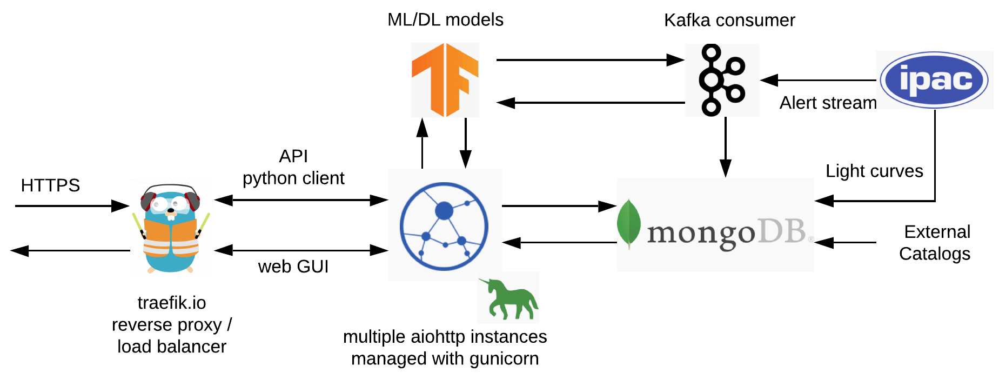
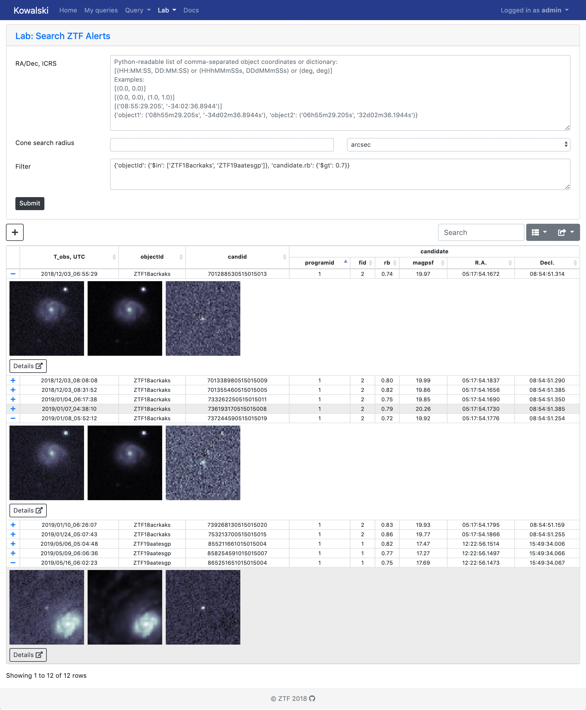

# Kowalski 1.0

The legendary [ZTF](https://ztf.caltech.edu) time domain astronomy penguin: 
`docker`-ized and powered by `aiohttp` and `mongodb` to deliver improved performance and robustness.

## Architecture of Kowalski



## ZTF Alert Lab

 

## Python client `penquins`

Install the client library [penquins.py](https://github.com/dmitryduev/kowalski/blob/master/penquins.py), 
with `pip` into your environment:

```bash
pip install git+https://github.com/dmitryduev/kowalski.git
```

`penuquins` is very lightweight and only depends on `pymongo` and `requests`.

---

## Build your own Kowalski: production service  

### Set-up instructions

#### Pre-requisites

Clone the repo and cd to the cloned directory:
```bash
git clone https://github.com/dmitryduev/kowalski.git
cd kowalski
```

Create `secrets.json` with confidential/secret data:
```json
{
  "server" : {
    "admin_username": "ADMIN",
    "admin_password": "PASSWORD"
  },
  "database": {
    "admin": "mongoadmin",
    "admin_pwd": "mongoadminsecret",
    "user": "user",
    "pwd": "pwd"
  },
  "kafka": {
    "bootstrap.servers": "IP1:PORT,IP2:PORT"
  },
  "kafka-topics": {
    "zookeeper": "IP:PORT"
  }
}
```

#### Using `docker-compose` (for production)

Change `kowalski.caltech.edu` in `docker-compose.yml` and in `traefik/traefik.toml` to your domain. 

Run `docker-compose` to start the service:
```bash
docker-compose up --build -d
```

You may have to use `sudo` to run the build command if `traefik` complains about `acme.json` access privileges.

To tear everything down (i.e. stop and remove the containers), run:
```bash
docker-compose down
```

---

#### Using plain `Docker` (for dev/testing)

If you want to use `docker run` instead:

Create a persistent Docker volume for MongoDB and to store data:
```bash
docker volume create kowalski_mongodb
docker volume create kowalski_data
```

Launch the MongoDB container. Feel free to change u/p for the admin, 
but make sure to change `secrets.json` and `docker-compose.yml` correspondingly.
```bash
docker run -d --restart always --name kowalski_mongo_1 -p 27023:27017 -v kowalski_mongodb:/data/db \
       -e MONGO_INITDB_ROOT_USERNAME=mongoadmin -e MONGO_INITDB_ROOT_PASSWORD=mongoadminsecret \
       mongo:latest
```

To connect to the db:
```bash
docker exec -it kowalski_mongo_1 /bin/bash
mongo -u mongoadmin -p mongoadminsecret --authenticationDatabase admin
```

Enable monitoring:
```
> db.enableFreeMonitoring()
```

Build and launch the app container:
```bash
docker build --rm -t kowalski:latest -f Dockerfile .
docker run --name kowalski -d --restart always -p 8000:4000 -v kowalski_data:/data -v /path/to/tmp:/_tmp --link kowalski_mongo_1:mongo kowalski:latest
# test mode:
docker run -it --rm --name kowalski -p 8000:4000 -v kowalski_data:/data -v /path/to/tmp:/_tmp --link kowalski_mongo_1:mongo kowalski:latest

```

`Kowalski` will be available on port 8000 of the `Docker` host machine. 

